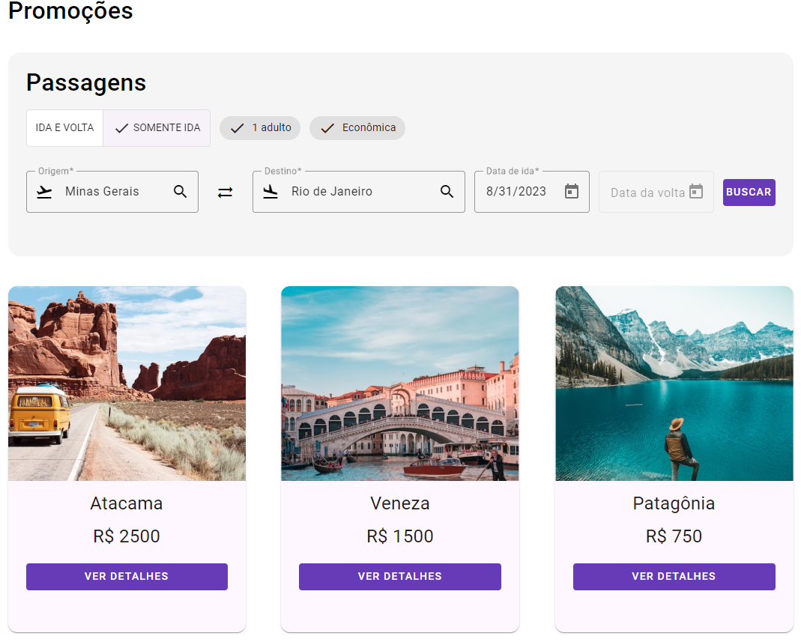
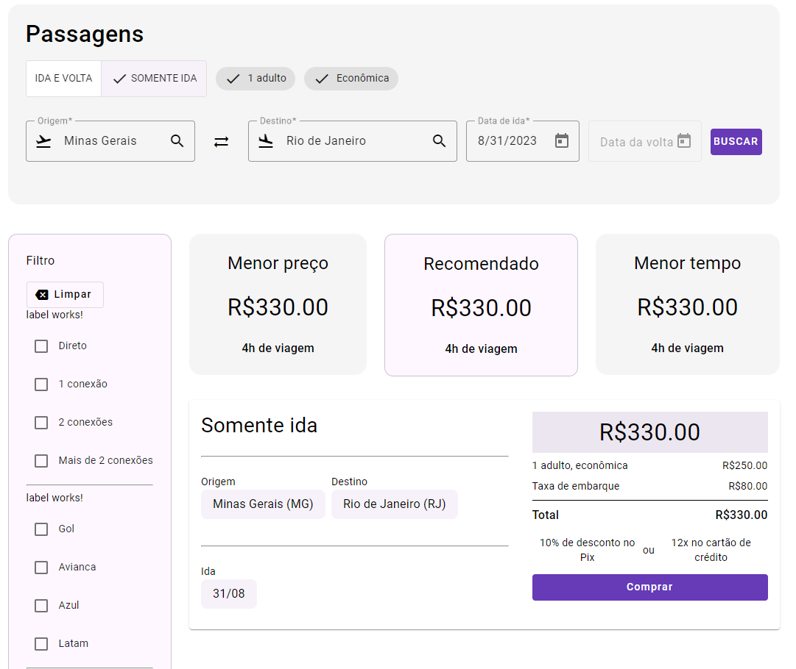
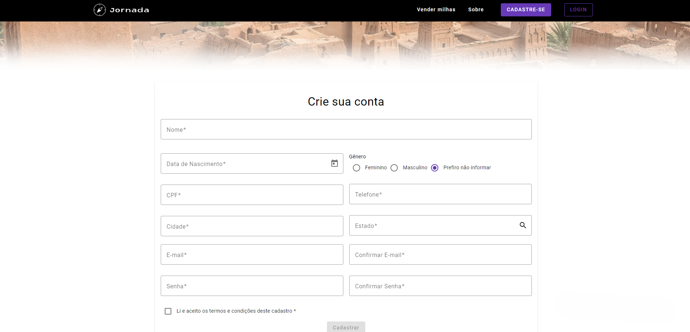
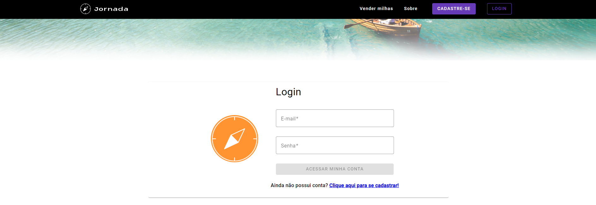
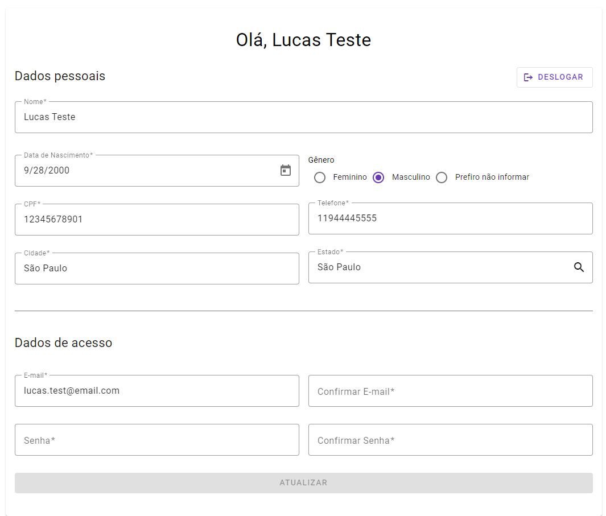

### 💻 Sobre
Projeto de estudos desenvolvido com base na formação da Alura em Aplicações Escaláveis com Angular.

## 🔨 Funcionalidades desenvolvidas no projeto
- [x] Controlar e validar formulários em Angular utilizando services
- [x] Interação com API backend para buscar, filtrar e exibir dados de maneira eficaz
- [x] Autenticação utilizando tokens JWT
- [x] Guardas de rotas funcionais para restringir o acesso a determinadas partes da aplicação
- [x] Interceptor de injeção de header de autenticação nas requisições
- [x] Modularização para organizar sua aplicação de forma lógica e reutilizável
- [x] Lazy Loading para melhorar o desempenho da aplicação ao carregar módulos sob demanda
- [x] Interceptor para manipular globalmente as requisições HTTP, adicionando funcionalidades como tratamento de erros
- [x] ESLint para manter o código limpo e consistente, garantindo a qualidade do projeto

## ✔️ Técnicas e tecnologias utilizadas

- `Angular`
- `Angular CLI`
- `Angular Material`
- `Figma`
- `ESLint`
- `Visual Studio Code`

## 🛠️ Abrir e rodar o projeto

Para abrir e rodar o projeto, execute `npm i` para instalar as dependências e `ng serve` para iniciar o projeto.

Depois, acesse <a href="http://localhost:4200/">http://localhost:4200/</a> no seu navegador.

O backend utilizado você encontra [aqui](https://github.com/viniciosneves/jornada-milhas-api).

### 📷 Demonstração da aplicação
<h4>Home Page</h4>

<h4>Formulário</h4>

<h4>Cadastro</h4>

<h4>Login</h4>

<h4>Perfil</h4>

